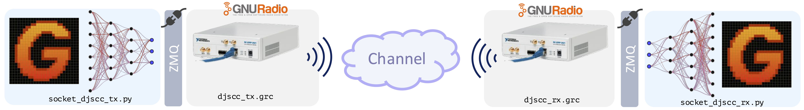
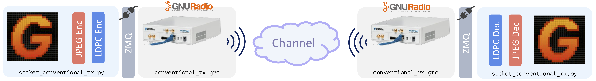
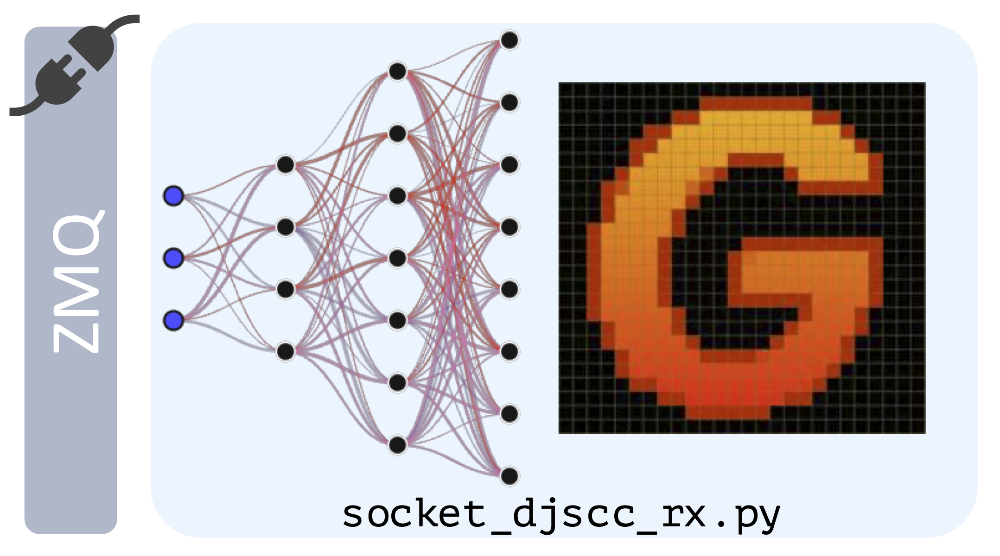
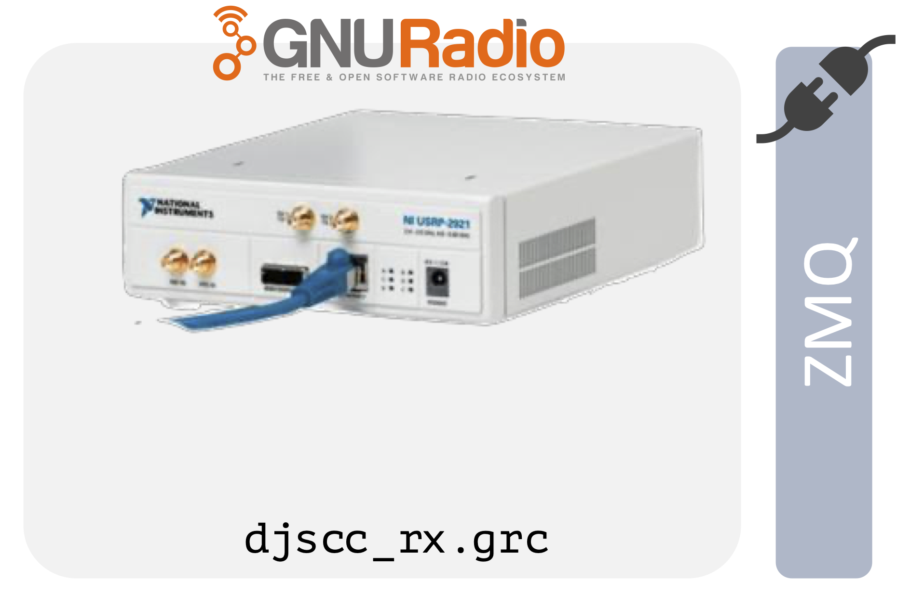
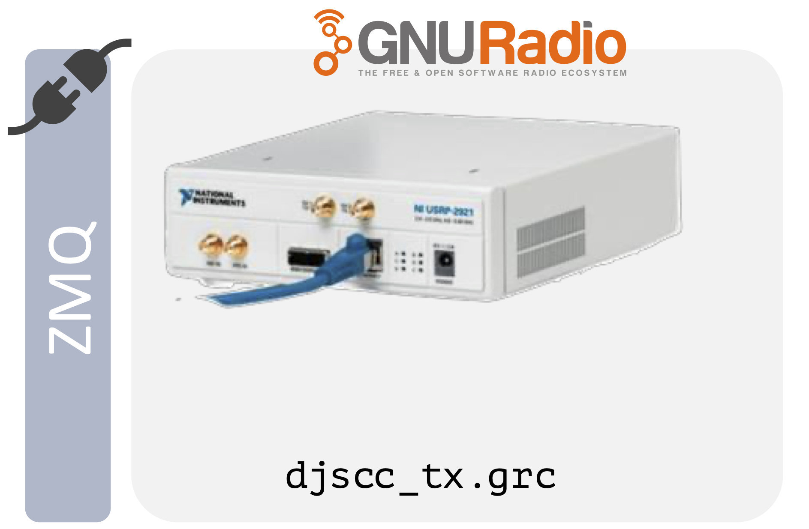
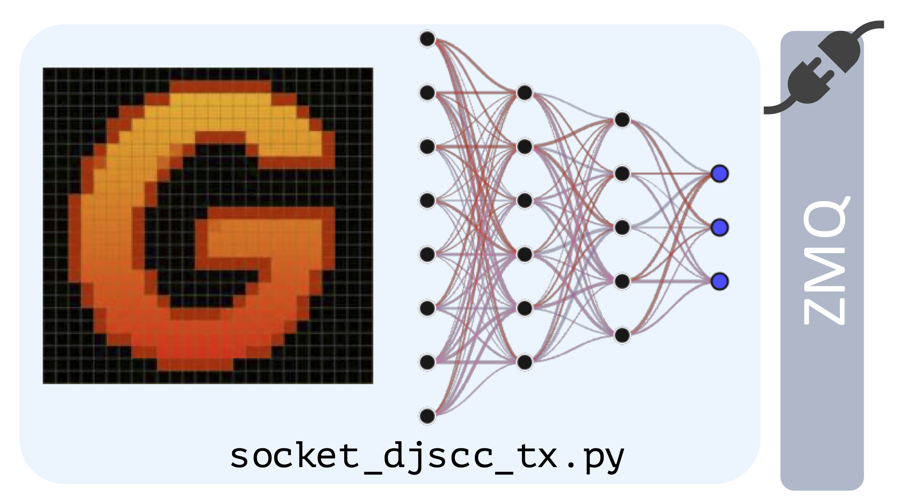
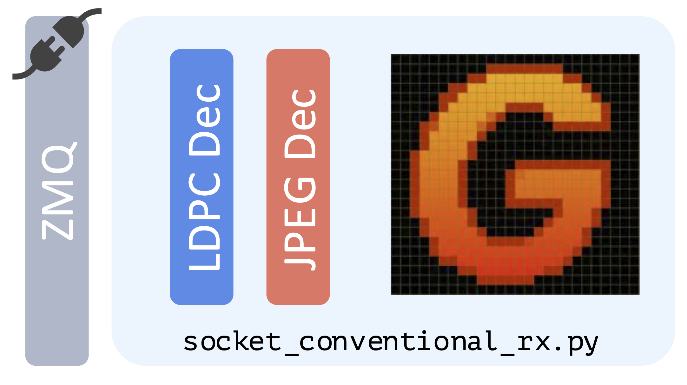
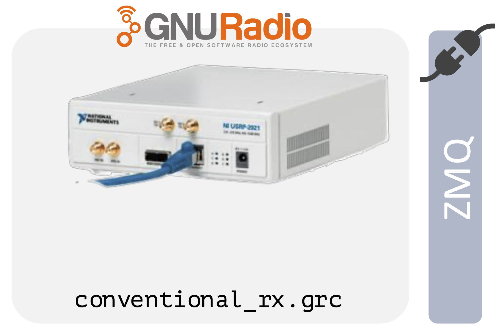
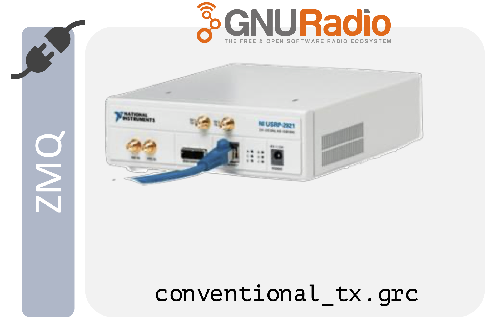
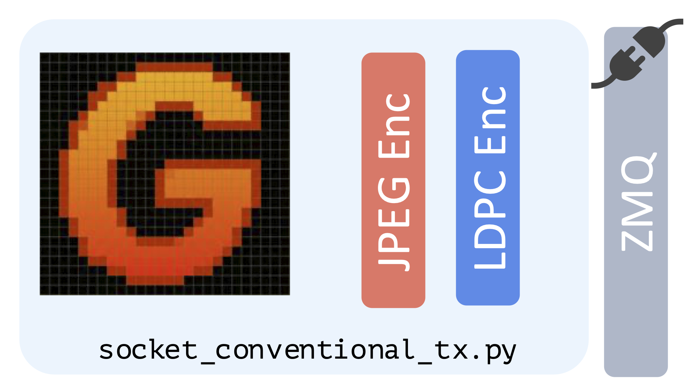

<div align="center">
  
  &nbsp;&nbsp;&nbsp;&nbsp;
  
</div>


# DeepJSCC Demo

**Authors:** Marcello Bullo, Meng Hua

**Reference**: m.bullo21@imperial.ac.uk, bullo.marcello@gmail.com

**Institution**: Imperial College London

**Description:** This repository contains a demonstration of Deep Joint Source-Channel Coding (DJSCC) along with a Conventional Separate Source-Channel Coding (SSCC) baseline (JPEG/JPEG2000+LDPC). The demo integrates Python-based deep learning models and traditional codecs with GNU Radio for Over-The-Air transmission.

**DJSCC Mode**  


**SSCC (Conventional) Mode**  


## Features
* **DJSCC Mode**: Neural network-based joint source-channel coding.
* **SSCC Mode**: Conventional JPEG/JPEG2000 image compression followed by LDPC error correction.
* **TX Dashboard**: A Streamlit-based web UI for live camera capture, manual transmission triggers, and live constellation plotting.
* **RX Dashboard**: A Streamlit-based web UI to control receiver modes and view reconstructed images.
* **GNU Radio Integration**: Uses ZMQ to interface between Python encoders/decoders and GNU Radio flowgraphs.

## Installation

1. **Clone the repository:**
   ```bash
   git clone https://github.com/marcellobullo/djscc-demo
   cd djscc_demo
   ```
2. **Create the environment**
    ```bash
    conda create -y --name demo python=3.11
    conda activate demo
    ```
    *(Note: The code has not been tested with other python version.)*

3. **Install Python dependencies:**
   ```bash
   ./install.sh
   ```
   If you are working on Windows or the install script throws an error, install the dependencies manually as follows:
    - Check manually the dependencies in `./install.sh` and install them
    - Install the `gr-deepjscc` module
        ```bash 
        cd gr-modules/gr-deepjscc
        mkdir -p build
        cd build
        cmake -DCMAKE_INSTALL_PREFIX="$CONDA_PREFIX" ..
        make -j4
        make install
        cd ../../..
        ```
    - Download the DJSCC weights 
        ```
        bash ./download_model_checkpoints.sh
        ```

## Running the Demo (CLI)

You can run the demo in either **DJSCC** or **SSCC** mode. Open separate terminal windows for the Receiver (RX) and Transmitter (TX) components.

---
### DJSCC Mode

#### Receiver (RX)
1. Start the Python receiver:
   ```bash
   python receiver/socket_djscc_rx.py --model ./model_checkpoints/AWGN_rate_16_AD_JSCC_SNR_random_EP_3.pth --no-save --comp-ratio 6
   ```
   
2. Start the GNU Radio receiver flowgraph:
   ```bash
   python receiver/gnu_radio/djscc_rx.py
   ```
   

#### Transmitter (TX)
1. Start the GNU Radio transmitter flowgraph:
   ```bash
   python transmitter/gnu_radio/djscc_tx.py
   ```
   
2. Start the Python transmitter:
   ```bash
   python transmitter/socket_djscc_tx.py --model ./model_checkpoints/AWGN_rate_16_AD_JSCC_SNR_random_EP_3.pth --no-warmup --comp-ratio 6
   ```
   

---

### SSCC Mode (Conventional)

#### Receiver (RX)
1. Start the conventional Python receiver:
   ```bash
   python receiver/socket_conventional_rx.py --codec jpeg --bits-per-symbol 2 --ldpc-n 1920 --ldpc-k 960 --no-save --bp-iters 10 --demap soft --interleave
   ```
     
2. Start the GNU Radio receiver flowgraph:
   ```bash
   python receiver/gnu_radio/conventional_rx.py
   ```
     

#### Transmitter (TX)
1. Start the GNU Radio transmitter flowgraph:
   ```bash
   python transmitter/gnu_radio/conventional_tx.py
   ```
     
2. Start the conventional Python transmitter:
   ```bash
   python transmitter/socket_conventional_tx.py --codec jpeg --bits-per-symbol 2 --ldpc-n 1920 --ldpc-k 960 --bp-iters 10 --interleave
   ```
     

## Dashboards (Interactive UI)
Instead of using the CLI for the transmitter and receiver, you can launch the interactive Streamlit dashboards. They will manage the GNURadio and Python scripts for you:

**Transmitter Dashboard:**
```bash
streamlit run transmitter/tx_dashboard.py
```

**Receiver Dashboard:**
```bash
streamlit run receiver/rx_dashboard.py
```
